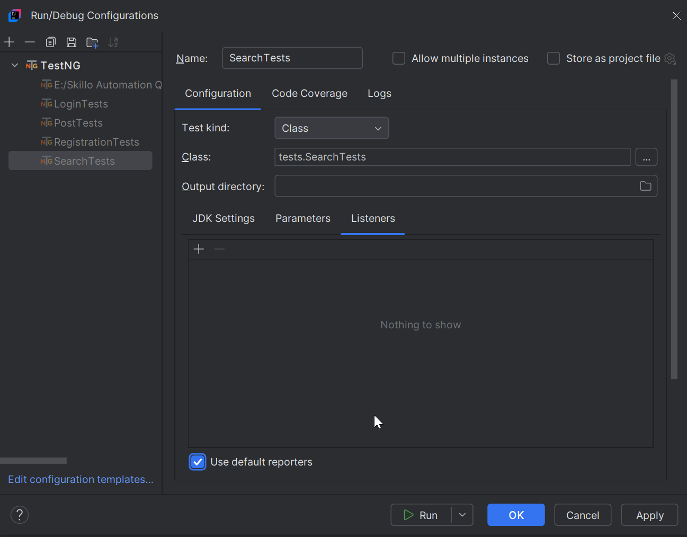

# Description
- This repository contains test automation framework based on Java, TestNG, Maven, Selenium and using as design patterns the Page Object Model and Page Factory
and is developed as final project for the Automation QA course of Skillo Academy
- Website under test: http://training.skillo-bg.com:4300/posts/all

# Prerequisites
You need to have installed on your machine:
1. JDK - version 22
2. IntelliJ - latest community version
3. Chrome latest version

# Overview
- Tests are located in src/test/java/tests.
- Before and after methods for the tests are in src/test/java/tests/BaseTest.
- In case a test fails, a screenshot is taken. All screenshots are located in src/test/resources/screenshots.
- Code for Page Factory model is located in src/main/java/page/factory.
- Code for Page Object Model is located in src/main/java/page/object/model.
- Test suites are located in testng.xml.

# How to run a test class with Page Factory OR Page Object Model 
- Open the desired test class, e.g. LoginTests.
- Check the imports - if they are using "page.object.model.", you will be executing the tests with Page Object Model. If you want to use the Page Factory, you need to use to change the imports to "page.factory.".
- Run the whole class or a single test only.

# How to run all tests using testng.xml
- Right click on testng.xml file and the click "Run '...\testng.xml".
- All tests classes added inside the file will be executed.

# Screenshots of failed tests
- If a test fails, a screenshot will be taken.
- To see the screenshots, go to src/test/resources/screenshots and check the screenshot.

# Reporting
- For reporting needs you can add as configuration in IntelliJ the default reporters.
- In order to activate the default reports, press Edit Configurations for each test class, go to tab Listeners and check "Use default reporters"
- See an example in the attached image:

- The generated reports after tests' runs can be found in /test-output directory: <>index.html and <>emailable-report.html

# The framework contains the following tests:
- tests.LoginTests.testLoginValidCredentials
- tests.LoginTests.testLoginInvalidCredentials
- tests.LogoutTests.testLogout
- tests.PostTests.testCreateAndDeletePost
- tests.ProfileTests.testProfilePage
- tests.ProfileTests.testModifyProfile
- tests.RegistrationTests.testRegistrationPageValidData
- tests.RegistrationTests.testRegistrationPageInvalidData
- tests.SearchTests.testSearchField